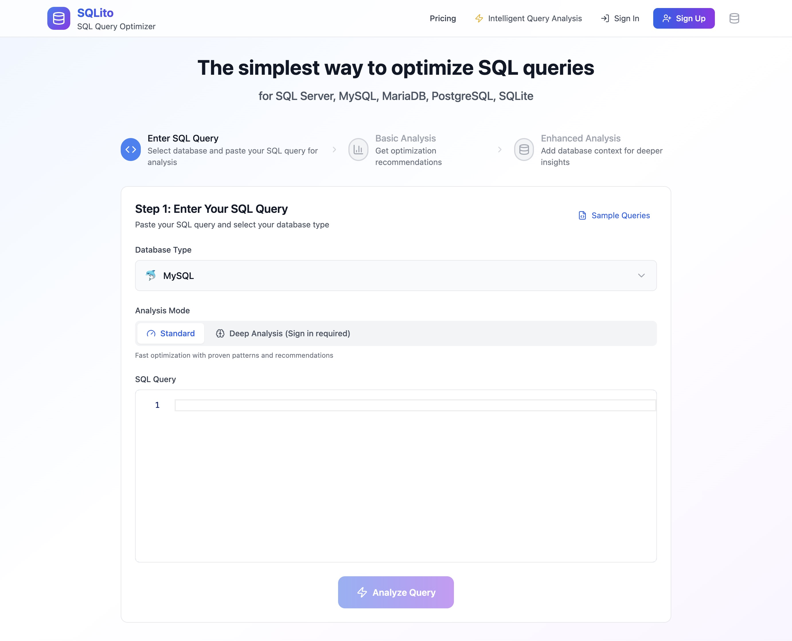

# SQLi.to — The AI SQL Query Optimizer

[SQLi.to](https://sqli.to) is a web-based **SQL query optimizer** for analyzing and improving SQL queries.

Supported engines:
- MySQL query optimization
- PostgreSQL query optimization
- SQL Server query optimization
- SQLite query optimization

## How it works
1. **Paste Your Query**  
   Enter your SQL query and select the database type.

2. **Get AI Suggestions**  
   Instantly receive optimized query rewrites, index recommendations, and performance insights.

3. **Add Context (Optional)**  
   Provide `EXPLAIN` output or schema information for deeper and more accurate analysis.

## Features
### Intuitive interface 
  Paste a query and analyze it instantly. No setup required.

### Query rewrite suggestions 
  Helps restructure inefficient queries and explains potential improvements.

### Index suggestions 
  Detects missing or ineffective indexes based on query structure.

### Two analysis modes
  - Standard mode: fast, single-pass analysis  
  - Agentic mode: deeper, multi-step reasoning for complex queries

### EXPLAIN & schema analysis 
  Interprets execution plans and analyzes table structure and indexes.

### Query history
  Keeps previously analyzed queries for easy reference.

### Share recommendations
  Share optimization results with your team.

## Use Cases
- Review slow or complex SQL queries  
- Understand execution plans and schema impact  
- Prepare optimization suggestions for code reviews  

## Status

Active development. Feedback and issues are welcome.
